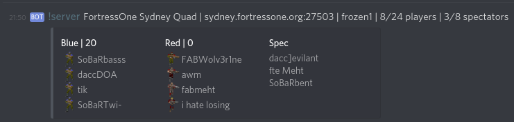
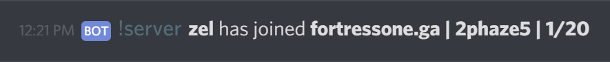

# QwtfDiscordBot

A Discord bot for checking the status of QuakeWorld Team Fortress servers


## Dependencies

  - Ruby >= 2.5.0
  - [qstat](https://github.com/multiplay/qstat) version with JSON support.  Tested with commit [2ab78bd5c30fbd47b2bdd4a6279296d66424b37e](https://github.com/multiplay/qstat/tree/2ab78bd5c30fbd47b2bdd4a6279296d66424b37e). Should be added to `$PATH`.


## Installation

    $ gem install qwtf_discord_bot


## Usage

- Create a bot on discord.
- Create a `config.yaml` file containing your bots credentials and server endpoints. E.G.

```yaml
---
token: "dhjksahdkjhhur43hu4hu5b4b5k34j12b4kj3b4kjb4j32kb4kjb4kb3k2b"
client_id: "873298379487294398"
endpoints:
  - "sydney.fortressone.org":
    - channel_ids:
      - 832749832749873298
      - 798437748937298448
  - "sydney.fortressone.org:27501":
    - channel_ids:
      - 590204247224745986
  - "dallas.fortressone.org":
    - channel_ids:
      - 480928490328409328
```

- Set the `QWTF_DISCORD_BOT_CONFIG_FILE` environment variable:

```sh
$ export QWTF_DISCORD_BOT_CONFIG_FILE="config.yaml"
```


### Commands

There are two modules:


#### Server

    $ qwtf-discord-bot server

This responds to discord messages:
  - `!server`
  - `!active`
  - `!all`




#### Watcher

    $ qwtf-discord-bot watcher

This watches the game server and announces if anyone has joined the server. It
polls the server once every 30 seconds and will only report a player joining if
they haven't been connected for more than ten minutes.




## License

The gem is available as open source under the terms of the [MIT License](https://opensource.org/licenses/MIT).
